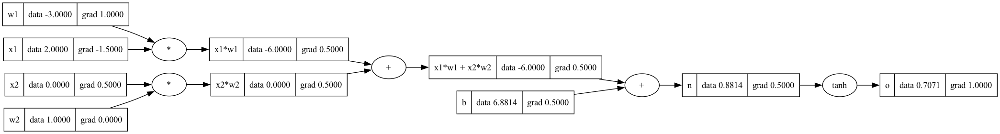

# Mini Autograd Library

A simple autograd library inspired by karpathy!

## Source Code

All of the source code is located in the `/src` directory.

## Data Structure

The library provides a `Value` object, inspired by PyTorch, which is a fundamental data structure for mathematical expressions. It supports operations such as addition, multiplication, division, exponentiation, and hyperbolic tangent. What's impressive is that it also calculates local derivatives for each operation. The chain rule is efficiently implemented, and the gradient is stored for multivariate calculus. The `backward` operation uses a topological sort to lay out the graph and iterates from right to left, allowing it to be performed on any mathematical expression that has undergone the `forward` operation.

## Graph

The library includes a `Graph` class that uses a directed graph for plotting mathematical operations. Each node in the graph contains data and gradient information. This is an excellent way to visualize your mathematical expressions or functions.

Basic single neuron graph,

## Neural Network

The library provides a `NeuralNetwork` class that includes implementations for a single neuron, a single layer, and a multi-layer perceptron. One of the most important features to note is the list of parameters being collected. These parameters (weights and bias) will be later used to control the loss.

## Training

The library provides a `train` function which performs network training by executing the forward pass, backward pass, and updating the parameters using a small learning rate. Before every backward pass, it is important to ensure that the parameters are flushed to prevent gradient accumulation issues, especially in large networks.

## Test Autograd

This test file allows you to create different inputs and desired outputs (`xs` and `ys`), using which you can run the training loop and observe the loss and the predicted output.

## Inspiration

*A straightforward automatic differentiation library, so profoundly inspired by Andrej Karpathy's legendary work in neural networks, it practically owes him a coffee. Karpathy, the neural network whisperer, whose innovative approaches are so clear, they make quantum physics look like a children's bedtime story. Thanks to him, our understanding of deep learning has leaped more than a caffeinated kangaroo in a trampoline park!*

